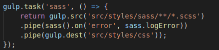
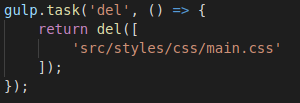
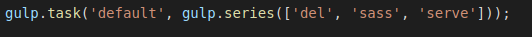
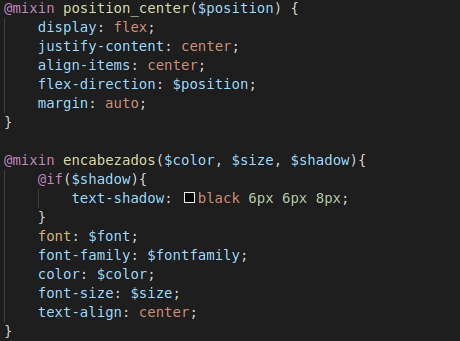
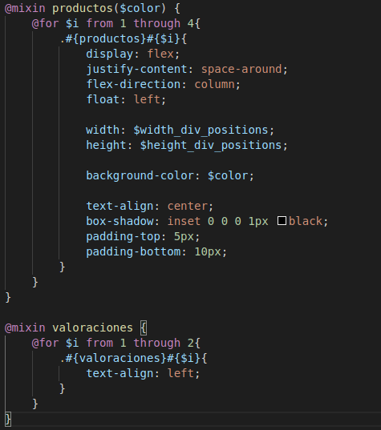
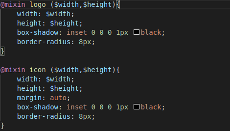
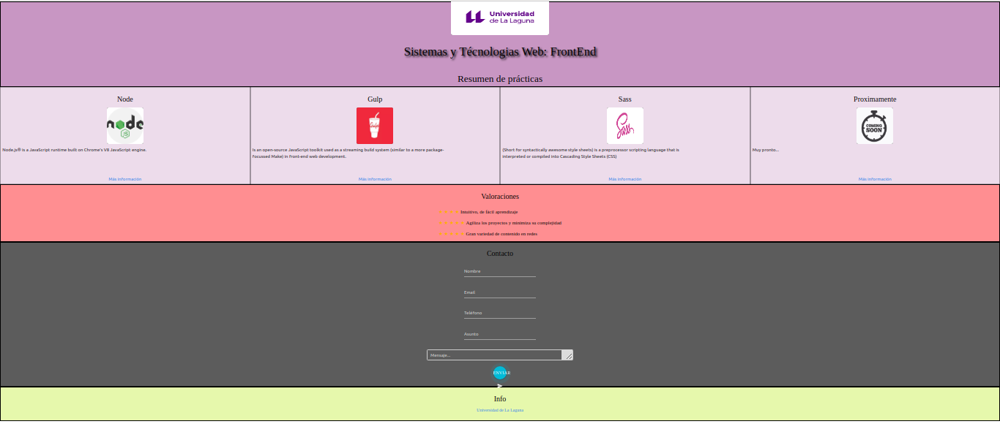

# Práctica2 
## SASS

### 1. Pre requisitos

Instalando los componentes necesarios para el desesarrollo de las actividades, se utilizaran los vitos en la práctica anterior y los necesarios para esta.

```
$ sudo apt-get install ruby
$ sudo gem install sass
```

```
$ sudo npm install gulp --save-dev
$ sudo npm install browser-sync --save-dev
$ sudo npm install gulp-sass --save-dev
$ sudo npm install dell --save-dev
```

### 2. Archivo gulp

Dentro del archivo **Gulpfile.js** se establecieron las siguientes tareas:

-Task *"sass"* la cual nos permite compilar todo el código del archivo **main.scss** al archivo **main.css**



-Task *"del*" que previo a la compilación del código sass, elimina el archivo css



-Task *"default"*, tarea por defecto donde se establece el orden de ejecución de todas las tareas: Primero *"del*" para quitar los archivos css, luego *"sass*" para compilar los archivos y por último *"serve"* para lanzar el servidor con el código de la aplicación. 



### 3. Mixin

Las llamadas a los mixin se realizaron para dar posicion y estilos a los textos, generacion de contenedores para visualisar "los productos" (temas de las prácticas) y configuración del logo (del encabezado) e iconos utilizados (logo de los productos).

- Posición y texto de los encabezados



- Productos y valoraciones



- Logo e iconos



### 4. Resultado 

Una vez ejecutadas todas las tareas, la página se visualiza con el siguiente contenido:



Los componentes de materialize usados se encuentran dentro del formulario de contacto, donde se utilizaron los textbox, textarea y el botón de enviar.